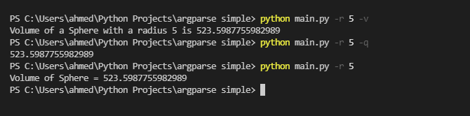

# Simple-Python-argparse

## Table of contents

- [Overview](#overview)
  - [Screenshot](#screenshot)
- [My process](#my-process)
  - [Built with](#built-with)
- [Author](#author)

## Overview

Calculates volume of sphere using argparse.

### Screenshot

## My process

exploring and understanding how different parsing libraries work.

### Built with

- Python
- Argparse module

## Author

- Website - [Ahmed Albarghouti](https://ahmedalbarghouti.github.io)
